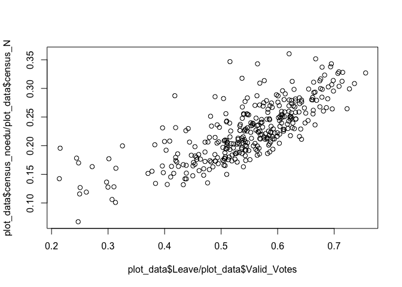
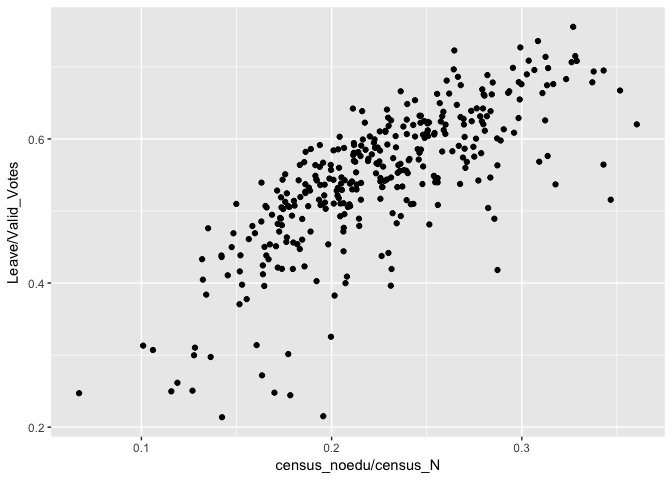
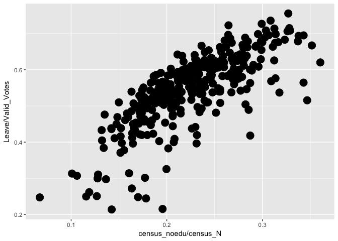
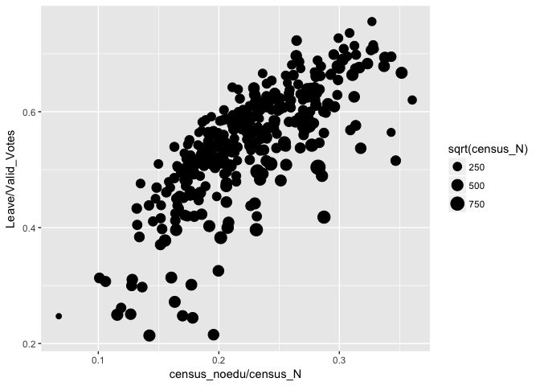
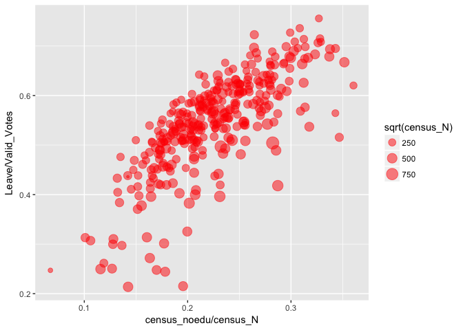
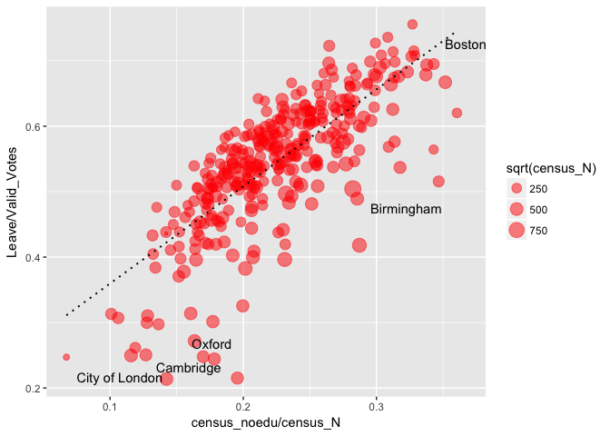
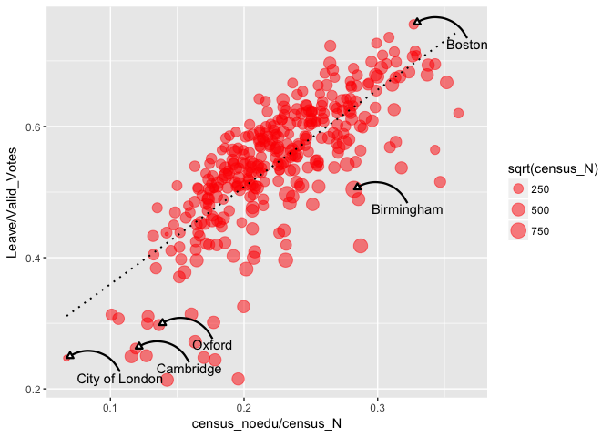
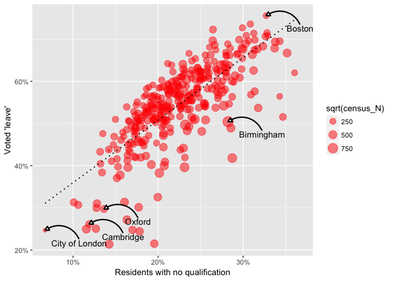
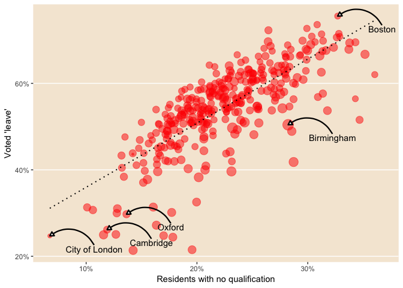

Goal
====

The goal of this document is to walk you through the steps needed to replicate the style of this plot that appeared on a [blog post](https://www.ft.com/content/1ce1a720-ce94-3c32-a689-8d2356388a1f) by John Burn-Murdoch using R and ggplot.


> NOTE: if you would like to download the the entire R code in a single executable R, you find it [here](https://raw.githubusercontent.com/fraba/ggplot_ws_replicate_ft_plot/master/main.R).

Getting the data
================

Since I couldn't find data on export from regions to the EU, I use instead the 2011 cesus data for qualification.

``` r
# Read from csv file
brexit_results <- 
  read.csv('http://www.electoralcommission.org.uk/__data/assets/file/0014/212135/EU-referendum-result-data.csv')

# Read from Excel file
library(readxl)
url <- 
  "http://webarchive.nationalarchives.gov.uk/20160105160709/http://www.ons.gov.uk/ons/rel/census/2011-census/key-statistics-for-local-authorities-in-england-and-wales/rft-table-ks501ew.xls"
destfile <- "rft_table_ks501ew.xls"
download.file(url, destfile)
noqualification_2011 <- read_excel(destfile, sheet = 2)
unlink(destfile)

# Merge two datasets
plot_data <-
  merge(brexit_results, noqualification_2011[,c(1,5,6)], 
        all = FALSE, 
        by.x = 'Area_Code', by.y = 'Table KS501EW')
names(plot_data)[22:23] <- c('census_N', 'census_noedu')
plot_data$census_noedu <- as.numeric(plot_data$census_noedu)
plot_data$census_N <- as.numeric(plot_data$census_N)
```

Exploring the correlation between the two variables
===================================================

``` r
plot(plot_data$census_noedu / plot_data$census_N, plot_data$Leave / plot_data$Valid_Votes)
```



ggplot: geom\_point()
=====================

Base plot
---------

``` r
require(ggplot2)

ggplot() +
  geom_point(
    data = plot_data, 
    aes(x=census_noedu/census_N, y=Leave/Valid_Votes)
  )
```



Map census population to point size
-----------------------------------

``` r
require(ggplot2)

ggplot() +
  geom_point(
    data = plot_data, 
    aes(x=census_noedu/census_N, y=Leave/Valid_Votes), 
    size=5
  )
```



``` r
require(ggplot2)

ggplot() +
  geom_point(
    data = plot_data, 
    aes(x=census_noedu/census_N, y=Leave/Valid_Votes, size=sqrt(census_N))
  )
```



``` r
require(ggplot2)

ggplot() +
  geom_point(
    data = plot_data, 
    aes(x=census_noedu/census_N, y=Leave/Valid_Votes, size=sqrt(census_N)),
    colour = 'red', alpha = 0.5
  )
```



Add regression line
-------------------

``` r
require(ggplot2)

ggplot(plot_data, aes(x=census_noedu/census_N, y=Leave/Valid_Votes)) +
  geom_point(
    data = plot_data, 
    aes(size=sqrt(census_N)),
    colour = 'red', alpha = 0.5
  ) +
  geom_smooth(method = 'lm', se = FALSE, linetype = "dotted", colour = 'black', size = 0.7)
```


Add label to random points
--------------------------

### Select four observations and add their label

``` r
rows_to_label <- grepl("^city of london$|^birmingham$|^boston$|^oxford$|^cambridge$", 
                       plot_data$Area, ignore.case = T)

subset_plot_data <- plot_data[rows_to_label,]

hshift <- 0.04
vshift <- 0.03

ggplot(plot_data, aes(x=census_noedu/census_N, y=Leave/Valid_Votes)) +
  geom_point(
    data = plot_data, 
    aes(size=sqrt(census_N)),
    colour = 'red', alpha = 0.5
  ) +
  geom_smooth(method = 'lm', se = FALSE, linetype = "dotted", colour = 'black', size = 0.7) +
  geom_text(data = subset_plot_data, 
            aes(x=census_noedu/census_N+hshift, y=Leave/Valid_Votes-vshift, label = Area))
```



### Add the arrows

``` r
ggplot(plot_data, aes(x=census_noedu/census_N, y=Leave/Valid_Votes)) +
  geom_point(
    data = plot_data, 
    aes(size=sqrt(census_N)),
    colour = 'red', alpha = 0.5
  ) +
  geom_smooth(method = 'lm', se = FALSE, linetype = "dotted", colour = 'black', size = 0.7) +
  geom_text(data = subset_plot_data, 
            aes(x=census_noedu/census_N+hshift, y=Leave/Valid_Votes-vshift, label = Area)) +
  geom_curve(data = subset_plot_data, 
             aes(x=census_noedu/census_N+hshift, 
                 xend=census_noedu/census_N,
                 y=Leave/Valid_Votes-(vshift-0.009),
                 yend=Leave/Valid_Votes),
             curvature = 0.5, 
             arrow = arrow(length = unit(0.2,"cm"), type = "closed"),
             size = 0.8
             )
```



Add axis labels and change scales
---------------------------------

``` r
require(scales)

ggplot(plot_data, aes(x=census_noedu/census_N, y=Leave/Valid_Votes)) +
  geom_point(
    data = plot_data, 
    aes(size=sqrt(census_N)),
    colour = 'red', alpha = 0.5
  ) +
  geom_smooth(method = 'lm', se = FALSE, linetype = "dotted", colour = 'black', size = 0.7) +
  geom_text(data = subset_plot_data, 
            aes(x=census_noedu/census_N+hshift, y=Leave/Valid_Votes-vshift, label = Area)) +
  geom_curve(data = subset_plot_data, 
             aes(x=census_noedu/census_N+hshift, 
                 xend=census_noedu/census_N,
                 y=Leave/Valid_Votes-(vshift-0.009),
                 yend=Leave/Valid_Votes),
             curvature = 0.5, 
             arrow = arrow(length = unit(0.2,"cm"), type = "closed"),
             size = 0.8
             ) +
  scale_x_continuous(label = percent) +
  scale_y_continuous(label = percent) +
  labs(x = 'Residents with no qualification', y = "Voted 'leave'")
```



Change theme
------------

``` r
ggplot(plot_data, aes(x=census_noedu/census_N, y=Leave/Valid_Votes)) +
  geom_point(
    data = plot_data, 
    aes(size=sqrt(census_N)),
    colour = 'red', alpha = 0.5
  ) +
  geom_smooth(method = 'lm', se = FALSE, linetype = "dotted", colour = 'black', size = 0.7) +
  geom_text(data = subset_plot_data, 
            aes(x=census_noedu/census_N+hshift, y=Leave/Valid_Votes-vshift, label = Area)) +
  geom_curve(data = subset_plot_data, 
             aes(x=census_noedu/census_N+hshift, 
                 xend=census_noedu/census_N,
                 y=Leave/Valid_Votes-(vshift-0.009),
                 yend=Leave/Valid_Votes),
             curvature = 0.5, 
             arrow = arrow(length = unit(0.2,"cm"), type = "closed"),
             size = 0.8
             ) +
  scale_x_continuous(label = percent) +
  scale_y_continuous(label = percent) +
  labs(x = 'Residents with no qualification', y = "Voted 'leave'") +
  theme(
    panel.background = element_rect(fill = "#F5E8D7"),
    panel.grid.minor.x = element_blank(),
    panel.grid.major.x = element_blank(),
    panel.grid.minor.y = element_blank()) +
  guides(size=FALSE)
```


