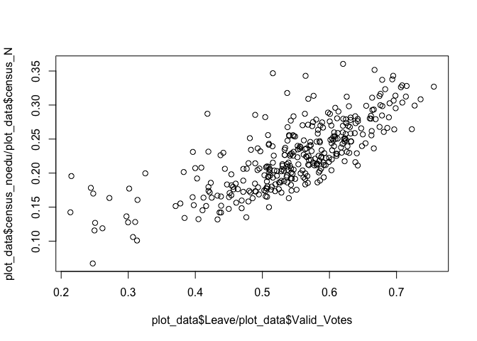

``` r
knitr::opts_chunk$set(echo=FALSE, warning=FALSE, message=FALSE)
```

Goal
====

The goal of this document is to walk you through the steps needed to replicate this plot that appeared on a [blog post](https://www.ft.com/content/1ce1a720-ce94-3c32-a689-8d2356388a1f) by John Burn-Murdoch.

 using R and ggplot.

    ## DEFINEDNAME: 21 00 00 01 0b 00 00 00 04 00 00 00 00 00 00 0d 3b 00 00 0e 00 0e 00 00 00 0b 00 
    ## DEFINEDNAME: 20 00 00 01 0b 00 00 00 01 00 00 00 00 00 00 06 3b 01 00 00 00 53 00 00 00 0a 00 
    ## DEFINEDNAME: 21 00 00 01 0b 00 00 00 04 00 00 00 00 00 00 0d 3b 00 00 0e 00 0e 00 00 00 0b 00 
    ## DEFINEDNAME: 20 00 00 01 0b 00 00 00 01 00 00 00 00 00 00 06 3b 01 00 00 00 53 00 00 00 0a 00 
    ## DEFINEDNAME: 21 00 00 01 0b 00 00 00 04 00 00 00 00 00 00 0d 3b 00 00 0e 00 0e 00 00 00 0b 00 
    ## DEFINEDNAME: 20 00 00 01 0b 00 00 00 01 00 00 00 00 00 00 06 3b 01 00 00 00 53 00 00 00 0a 00 
    ## DEFINEDNAME: 21 00 00 01 0b 00 00 00 04 00 00 00 00 00 00 0d 3b 00 00 0e 00 0e 00 00 00 0b 00 
    ## DEFINEDNAME: 20 00 00 01 0b 00 00 00 01 00 00 00 00 00 00 06 3b 01 00 00 00 53 00 00 00 0a 00


