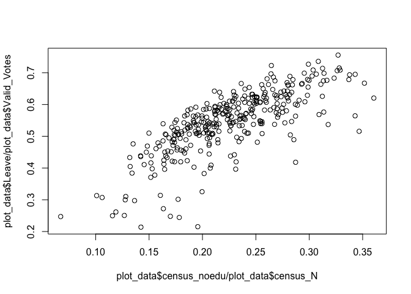

``` r
knitr::opts_chunk$set(echo=TRUE, warning=FALSE, message=FALSE)
```

Goal
====

The goal of this document is to walk you through the steps needed to replicate the style of this plot that appeared on a [blog post](https://www.ft.com/content/1ce1a720-ce94-3c32-a689-8d2356388a1f) by John Burn-Murdoch using R and ggplot.


Since I couldn't find data on export from regions to the EU, I use instead the 2011 cesus data for qualification.

``` r
# Read from csv file
brexit_results <- 
  read.csv('http://www.electoralcommission.org.uk/__data/assets/file/0014/212135/EU-referendum-result-data.csv')

# Read from Excel file
library(readxl)
url <- 
  "http://webarchive.nationalarchives.gov.uk/20160105160709/http://www.ons.gov.uk/ons/rel/census/2011-census/key-statistics-for-local-authorities-in-england-and-wales/rft-table-ks501ew.xls"
destfile <- "rft_table_ks501ew.xls"
download.file(url, destfile)
noqualification_2011 <- read_excel(destfile, sheet = 2)
unlink(destfile)

# Merge two datasets
plot_data <-
  merge(brexit_results, noqualification_2011[,c(1,5,6)], 
        all = FALSE, 
        by.x = 'Area_Code', by.y = 'Table KS501EW')
names(plot_data)[22:23] <- c('census_N', 'census_noedu')
plot_data$census_noedu <- as.numeric(plot_data$census_noedu)
plot_data$census_N <- as.numeric(plot_data$census_N)
```

``` r
plot(plot_data$Leave / plot_data$Valid_Votes, plot_data$census_noedu / plot_data$census_N)
```


